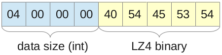
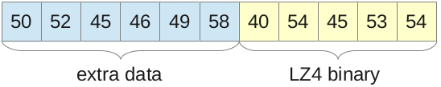
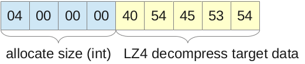
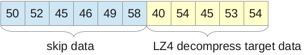

# LZ4 Extension for PHP

[](https://github.com/kjdev/php-ext-lz4/actions?query=workflow%3ALinux+branch%3Amaster)
[](https://github.com/kjdev/php-ext-lz4/actions?query=workflow%3AWindows+branch%3Amaster)

This extension allows LZ4.

Documentation for LZ4 can be found at
[» https://github.com/Cyan4973/lz4](https://github.com/Cyan4973/lz4).

## Build from sources

    % git clone --recursive --depth=1 https://github.com/kjdev/php-ext-lz4.git
    % cd php-ext-lz4
    % phpize
    % ./configure
    % make
    % make install

To use the system library

``` bash
% ./configure --with-lz4-includedir=/usr
```

## Distribution binary packages

### Fedora / CentOS / RHEL

RPM packages of this extension are available in [» Remi's RPM repository](https://rpms.remirepo.net/) and are named **php-lz4**.

### Debian

DEB packages of this extension are available in [» Ondřej Surý's DEB repository](https://deb.sury.org/) and are named **php-lz4**.


## Configuration

php.ini:

    extension=lz4.so

## Function

* lz4\_compress — LZ4 compression
* lz4\_uncompress — LZ4 decompression

### lz4\_compress — LZ4 compression

#### Description

string **lz4\_compress** ( string _$data_ [ , int _$level_ = 0 , string _$extra_ = NULL ] )

LZ4 compression.

#### Pameters

* _data_

  The string to compress.

* _level_

  The level of compression (1-12, Recommended values are between 4 and 9).
  (Default to 0, Not High Compression Mode.)

* _extra_

  Prefix to compressed data.

#### Return Values

Returns the compressed data or FALSE if an error occurred.


### lz4\_uncompress — LZ4 decompression

#### Description

string **lz4\_uncompress** ( string _$data_ [ , long _$maxsize_ = -1 , long _$offset_ = -1 ] )

LZ4 decompression.

#### Pameters

* _data_

  The compressed string.

* _maxsize_

  Allocate size output data.

* _offset_

  Offset to decompressed data.

#### Return Values

Returns the decompressed data or FALSE if an error occurred.

## Examples

    $data = lz4_compress('test');

    lz4_uncompress($data);

## Compress Data

### Default

    $data = lz4_compress('test')



### Extra prefix data

    $data = lz4_compress('test', false, 'PREFIX')



## Uncompress Data

### Default

    lz4_uncompress($data);



### Offset

    lz4_uncompress($data, 256, 6);


